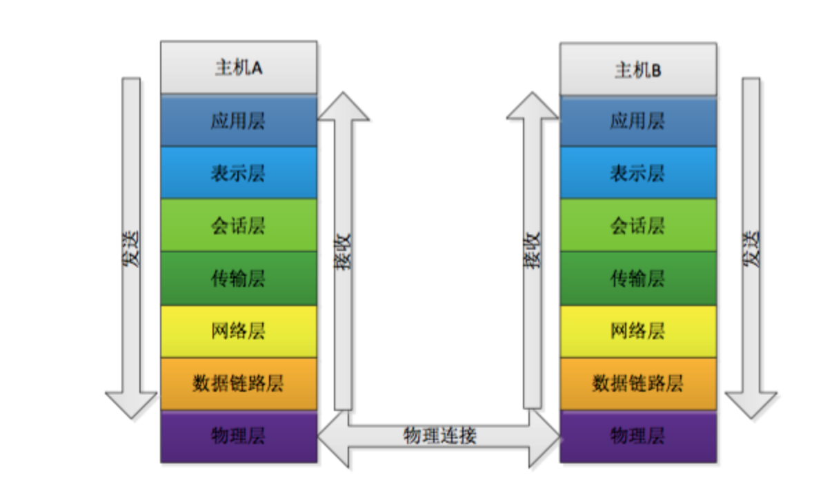

七层模型介绍：
**物理层：**物理层负责最后将信息编码成电流脉冲或其它信号用于网上传输。
>eg：RJ45等将数据转化成0和1

**数据链路层：**数据链路层通过物理网络链路供数据传输。不同的数据链路层定义了不同的w网络和协议特征，其中包括物理编址、网络拓扑结构、错误校验数据帧序列以及流控。
>可以简单的理解为：规定了0和1的分包形式，确定了网络数据包的形式

**网络层：**网络层负责在源和终点之间建立连接
>可以理解为，此处需要确定计算机的位置，怎么确定？IPv4，IPv6

**传输层：**传输层向高层提供可靠的端到端的网络数据流服务
>可以理解为：每一个应用程序都会在网卡注册一个端口号，该层就是端口与端口的通信！常用的（TCP／IP）协议

**会话层：**会话层建立、管理和终止表示层与实体之间的通信会话
>建立一个连接（自动的手机信息、自动的网络寻址）

**表示层：**表示层供多种功能用于应用层数据编码和转化，以确保以一个系统应用层发送的消息可以被另一个系统应用层识别
>可以理解为：解决不同系统之间的通信，eg：Linux下的QQ和Windows下的QQ可以通信

**应用层：**应用层协议包括文件的传输、访问及管理协议（FTAM），以及文件虚拟终端协议（VIP）和公用管理系统信息（CMIP）等；
>规定数据的传输协议；常见的应用层协议：HTTP，HTTPS，FTP

**参考资料:**
[网络七层模型&&网络数据包](http://www.jianshu.com/p/4b9d43c0571a)
