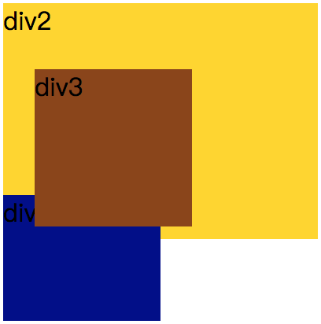
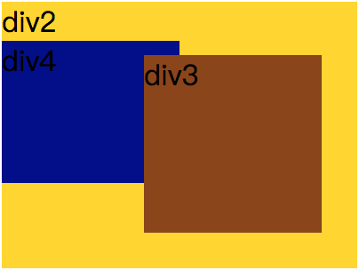

`position:static;`//position的默认值，表示元素按照标准文档流定位，设置left，top，right，bottom，z-index无效。

`position:relative;`//按照标准文档流相对定位，不设置left，top，right，bottom，z-index时，位置和static时一样，设置left，top，right，bottom，z-index时会相对于它在static时的位置定位。其他的元素的位置则不会受该元素的影响发生位置改变来弥补它偏离后剩下的空隙。也就是说其它元素的位置和它是static时一样。代码如下：
```
<style>
#div2{
    background: gold;
    height: 150px;
    margin-left: 20px;
    width: 200px;
}
#div3{
    position: relative;
    left: 20px;
    top: 20px;
    width: 100px;
    background: saddlebrown;
    height: 100px;
}
#div4{
	width: 100px;
	height: 80px;
	background: darkblue;
 }
</style>
<div id="div2">
     <div id="div3"></div>
     <div id="div4"></div>
</div>
```
效果图：

div3是relative定位，位置偏移了，但div4的位置仍然和div3为偏移时一样。

`position: absolute;`脱离文档流的绝对定位。脱离文档流意味着文档流里的元素会当它不存在一样定位。absolute是相对于它的第一个定位不是static的祖先元素定位。如果绝对定位（position属性的值为absolute）的元素没有“positioned”祖先元素，那么它是相对于文档的 body 元素，并且它会随着页面滚动而移动。代码如下：
```
<style>
        #div2{
            background: gold;
            height: 150px;
            margin-left: 20px;
            width: 200px;
            position: relative;
        }
        #div3{
            position: absolute;
            right: 20px;
            bottom: 20px;
            width: 100px;
            background: saddlebrown;
            height: 100px;
        }
        #div4{
            width: 100px;
            height: 80px;
            background: darkblue;
        }
    </style>
<div id="div2">
    div2
    <div id="div3">div3</div>
    <div id="div4">div4</div>
</div>
```
效果图：


`position:fixed;`脱离文档流的固定定位，元素会相对于视窗来定位，这意味着即便页面滚动，它还是会停留在相同的位置。和 relative 一样， top 、 right 、 bottom 和 left 属性都可用。

`position:sticky'`粘性定位。是一个新的css3属性。

它的表现类似position:relative和position:fixed的合体，在目标区域在屏幕中可见时，它的行为就像position:relative; 而当页面滚动超出目标区域时，它的表现就像position:fixed，它会固定在目标位置。**（这是网上的大多数说法，但不完全对，这只适用于sticky定位元素是body的子元素时的情况。如果sticky定位元素的父元素，情况就会不一样。具体的请看下面的代码分析）**

但总的来说元素定位表现为在跨越特定阈值前为相对定位，之后为固定定位，只是固定定位相对的对象比较复杂不一定是浏览器窗口。
并且 top 和 bottom 同时设置时，top 生效的优先级高，left 和 right 同时设置时，left 的优先级高

以下是我经过测试后的结果：
**position:sticky生效条件：**
1、设置了top或bottom，left或right
2、父元素要全部可见，这里的可见是指父元素本身不能被父元素的父级元素的overflow:hidden给盖住，使父元素的最小高度不能全部可见。
3、父元素本身不能设置overflow:hidden。
4、如果父元素的overflow的值为auto、scroll等使得父元素的内容不溢出的属性时，sticky定位的元素的定位是相对于它的父元素的而不是浏览器窗口。如果父元素的内容允许溢出且溢出内容超出浏览器窗口，sticky定位的元素的定位是相对于浏览器窗口的。
**下面是测试代码：**
```
 <style type="text/css">
        body{
            margin: 0;
            padding: 0;
        }
        #bottom{
            width: 100%;
            height: 70px;
            line-height: 70px;
            text-align: center;
            background: lightblue;
            position: sticky;
            margin: 0;
            bottom: 0px;
        }
        #top{
            width: 100%;
            height: 70px;
            line-height: 70px;
            text-align: center;
            background: lightblue;
            position: sticky;
            margin: 0;
            top: 0px;
        }
        #div0{
            width: 100%;
            height: 200px;
        }
        #div1{
            height: 400px;
//分别调整height:800px，调整overflow的值为auto，visible等值可以看到效果
            overflow: auto;
        }
    </style>
<div id="div0">
	<div id="div1">
	<h2 id="top">顶部</h2>
	<ul>
		    <li>内容</li><li>内容</li><li>内容</li><li>内容</li><li>内容</li><li>内容</li><li>内容</li><li>内容</li><li>内容</li><li>内容</li><li>内容</li><li>内容</li><li>内容</li><li>内容</li><li>内容</li><li>内容</li><li>内容</li><li>内容</li><li>内容</li><li>内容</li><li>内容</li><li>内容</li><li>内容</li><li>内容</li><li>内容</li><li>内容</li><li>内容</li><li>内容</li><li>内容</li><li>内容</li><li>内容</li><li>内容</li><li>内容</li><li>内容</li><li>内容</li>
	    
	</ul>
	<div id="bottom">底部</div>
	</div>
</div>
```